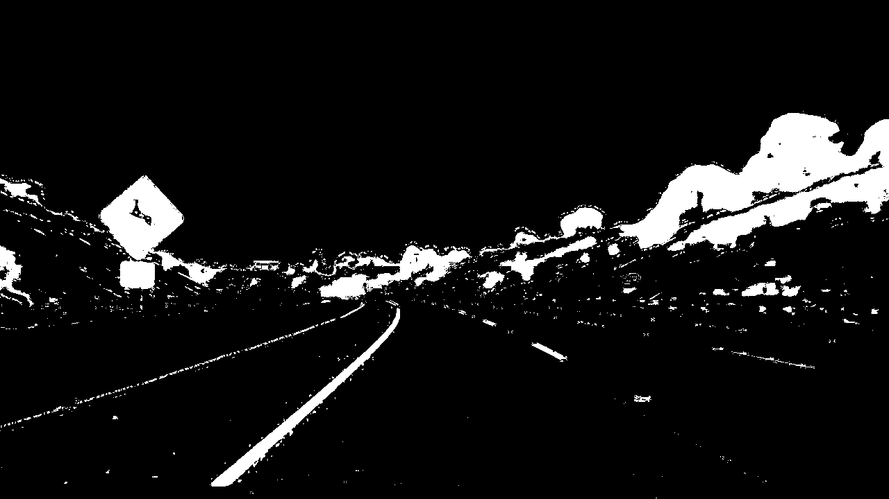

## Writeup Template

[//]: # (Image References)

[image1]: ./examples/undistort_output.png "Undistorted"
[image2]: ./test_images/test1.jpg "Road Transformed"
[image3]: ./examples/binary_combo_example.jpg "Binary Example"
[image4]: ./examples/warped_straight_lines.jpg "Warp Example"
[image5]: ./examples/color_fit_lines.jpg "Fit Visual"
[image6]: ./examples/example_output.jpg "Output"
[video1]: ./project_video.mp4 "Video"

## [Rubric](https://review.udacity.com/#!/rubrics/571/view) Points

### Here I will consider the rubric points individually and describe how I addressed each point in my implementation.  

---

### Writeup / README

#### 1. Provide a Writeup / README that includes all the rubric points and how you addressed each one.  You can submit your writeup as markdown or pdf.  [Here](https://github.com/udacity/CarND-Advanced-Lane-Lines/blob/master/writeup_template.md) is a template writeup for this project you can use as a guide and a starting point.  

You're reading it!

### Camera Calibration

#### 1. Briefly state how you computed the camera matrix and distortion coefficients. Provide an example of a distortion corrected calibration image.

The code for this step is contained in the file undistort.py.

I start by preparing "object points", which will be the (x, y, z) coordinates of the chessboard corners in the world. Here I am assuming the chessboard is fixed on the (x, y) plane at z=0, such that the object points are the same for each calibration image.  Thus, `objp` is just a replicated array of coordinates, and `objpoints` will be appended with a copy of it every time I successfully detect all chessboard corners in a test image.  `imgpoints` will be appended with the (x, y) pixel position of each of the corners in the image plane with each successful chessboard detection.  

I then used the output `objpoints` and `imgpoints` to compute the camera calibration and distortion coefficients using the `cv2.calibrateCamera()` function.  I applied this distortion correction to the test image using the `cv2.undistort()` function and obtained this result: 

### Pipeline (single images)

#### 1. Provide an example of a distortion-corrected image.

Now that we have our distortion coefficients and camera caliberation coefficients,we can easily use `cv2.undistort()` to get undistorted images as:

#### 2. Describe how (and identify where in your code) you used color transforms, gradients or other methods to create a thresholded binary image.  Provide an example of a binary image result.

I approached this section as hyper-parameter tuning.The tuning code is in `thresholding.py`. The approach here is to plot images in various color spaces by randomly selecting threshold values.This random selection is then converted into precise selection in the next iterations.Once ideal values were found,they were used in `solution.py` file in threshold method(221-241).

The result of this tuning was selection of L channel from LUV space,selection of B channel from Lab space and selection of H channel from HSV space.H channel gives depth to the lane lines while LUV and Lab color spaces identified lanelines near the image surface.

Here is a result-

#### 3. Describe how (and identify where in your code) you performed a perspective transform and provide an example of a transformed image.

The code for perspective transform is in `solution.py.` (245-249)

I decided to hard code the points by observation as-

| Source        | Destination   | 
|:-------------:|:-------------:| 
| 200, 720      | 300, 720        | 
| 1100, 720      | 980, 720      |
| 595, 450     | 300, 0      |
| 685, 450      | 980, 0        |

I verified that my perspective transform was working as expected by drawing the `src` and `dst` points onto a test image and its warped counterpart to verify that the lines appear parallel in the warped image.

#### 4. Describe how (and identify where in your code) you identified lane-line pixels and fit their positions with a polynomial?

I used the sliding window search using histograms to identify position of lane lines and then fit a 2 degree polynomial over them.In `solution.py` (253-331).

#### 5. Describe how (and identify where in your code) you calculated the radius of curvature of the lane and the position of the vehicle with respect to center.

I did this in lines 369 through 398 in my code in `solution.py`.I did this with the help of the formula of Radius of curvature described in the course material.

#### 6. Provide an example image of your result plotted back down onto the road such that the lane area is identified clearly.

I implemented this step in lines 334 through 364 in my code in `solution.py` in the function `draw_lane()`.  Here is an example of my result on a test image:

---

### Pipeline (video)

#### 1. Provide a link to your final video output.  Your pipeline should perform reasonably well on the entire project video (wobbly lines are ok but no catastrophic failures that would cause the car to drive off the road!).

Here's a [link to my video result](https://www.youtube.com/watch?v=e6EYTYEbTmI&)

---

### Discussion

#### 1. Briefly discuss any problems / issues you faced in your implementation of this project.  Where will your pipeline likely fail?  What could you do to make it more robust?

So,I really want you to elaborate on this issue.I tuned the parameters of various thresholds to arrive at a pipeline.Here the train images(in the folder test_images) were a part of our test video(the project video) so everything worked out well.
When I used these threshold values on the challenge video,it failed miserably to detect line(the problem is in thresholds).It seems impractical to renew thresholds everytime we want to process a new video.If anything,further tweaking threshold values to fit new video would result in departure from this video.
Am I missing something?How do we come up with something universal and concrete? 
